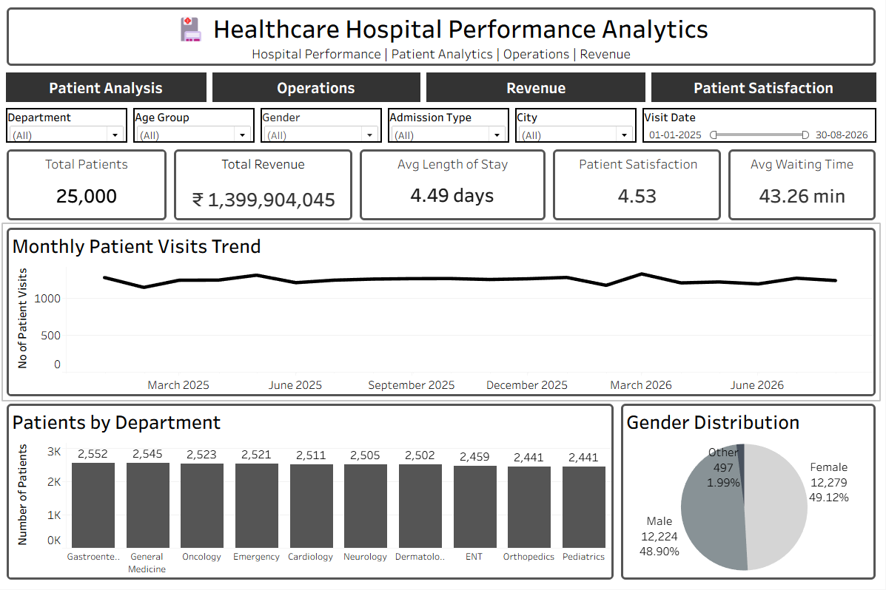
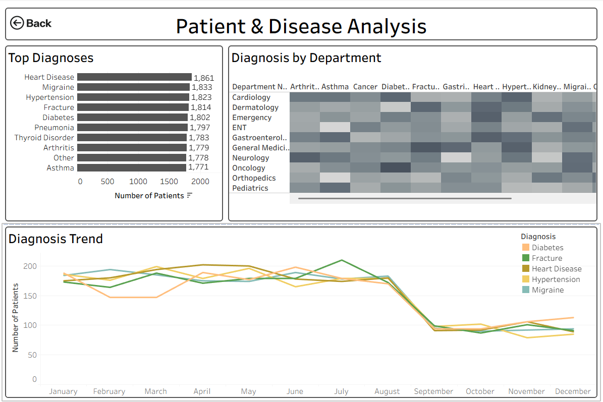
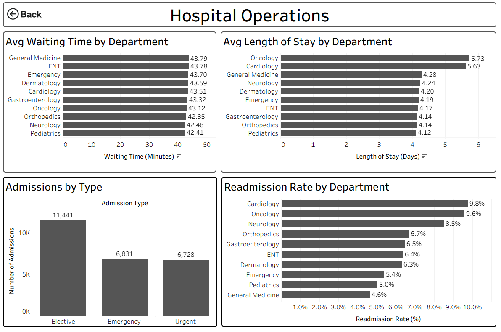
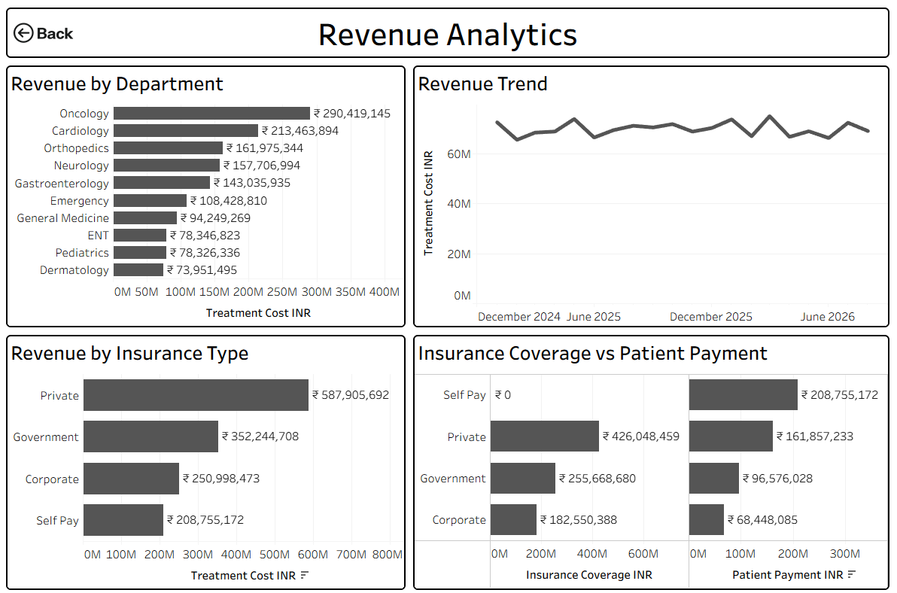
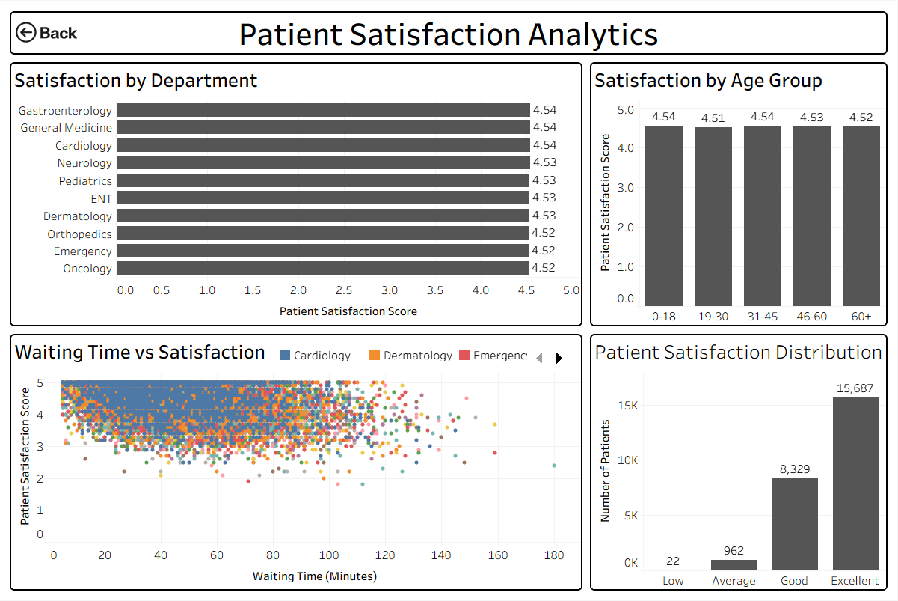

# 🏥 Healthcare Hospital Performance Analytics

A complete healthcare analytics project that combines **MySQL, SQL, Tableau, Python, and Flask** to manage and analyze hospital patient data.

The project includes a **Flask web application** for entering new patient records, a **MySQL database** for storing the data, and **Tableau dashboards** for interactive hospital performance analysis.

---

## 📌 Project Overview

The project follows this workflow:

**Flask Web Application → MySQL Database → SQL Analysis → Tableau Dashboards**

It uses **25,000+ patient records** to analyze:

- Patient volume
- Hospital operations
- Diagnoses
- Admissions
- Revenue
- Readmissions
- Waiting time
- Length of stay
- Patient satisfaction
- Insurance coverage

---

## 🛠️ Technologies Used

- **Python**
- **Flask**
- **MySQL**
- **SQL**
- **Tableau**
- **HTML**
- **CSS**

---

## 📊 Tableau Dashboards

The project contains 5 interactive dashboards:

### 1. Executive Hospital Overview

- Total Patients
- Total Revenue
- Average Length of Stay
- Patient Satisfaction
- Average Waiting Time
- Monthly Patient Visits
- Patients by Department
- Gender Distribution

### 2. Patient & Disease Analysis

- Top Diagnoses
- Diagnosis by Department
- Diagnosis Trend

### 3. Hospital Operations

- Average Waiting Time by Department
- Average Length of Stay
- Admissions by Type
- Readmission Rate by Department

### 4. Revenue Analytics

- Revenue by Department
- Revenue Trend
- Revenue by Insurance Type
- Insurance Coverage vs Patient Payment

### 5. Patient Satisfaction Analytics

- Satisfaction by Department
- Satisfaction by Age Group
- Waiting Time vs Satisfaction
- Patient Satisfaction Distribution

---

## 🗄️ Database

The project uses **MySQL** as the backend database.

Main tables include:

- `patients`
- `visits`
- `doctors`
- `departments`
- `admissions`
- `payments`
- `hospital_web_records`

The Flask application stores newly entered patient information directly into MySQL.

---

## 🔎 SQL Analysis

### SQL was used for:

- Data aggregation
- Table joins
- Filtering
- Grouping
- Conditional analysis
- Date-based analysis
- CTEs
- Window functions
- Hospital KPI calculations

### SQL Concepts Used

    SELECT
    WHERE
    GROUP BY
    HAVING
    ORDER BY
    JOIN
    CASE
    COUNT
    SUM
    AVG
    MIN
    MAX
    DISTINCT
    CTE
    Window Functions
    Date Functions
--- 
## 🌐 Flask Web Application
### The Flask application provides a web-based patient registration system.
### Main Features
- Patient registration
- Patient visit data entry
- MySQL database connection
- New record insertion
- Database record count
- Hospital data management
- Tableau-ready data workflow
### Workflow
    Enter Patient Data
           ↓
    Flask Application
           ↓
    MySQL Database
           ↓
    SQL Analysis
           ↓
    Tableau Dashboard

--- 
## 📈 Key Insights
### The dashboard helps analyze:
- Which departments receive more patients
- Which diagnoses are most common
- Department-wise waiting time
- Length of patient stay
- Admission patterns
- Revenue by department
- Revenue by insurance type
- Readmission rates
- Patient satisfaction
- Relationship between waiting time and satisfaction
---
## 📁 Project Structure
    Healthcare-Hospital-Performance-Analytics/
    │
    ├── app/
    │   ├── app.py
    │   └── venv/
    │
    ├── SQL_Analysis/
    │   ├── Database.sql
    │   ├── Import_Data.sql
    │   └── Import_Data_Analysis.sql
    │
    ├── image/
    │   └── dashboard screenshots
    │
    ├── healthcare_hospital_patient_analytics.xlsx
    │
    ├── Healthcare_Hospital_Performance_Analytics.twbx
    │
    └── README.md

---
## ▶️ How to Run the Flask Application
    1. Clone the Repository
    git clone <your-github-repository-url>
    
    2. Open the Project
    cd Healthcare-Hospital-Performance-Analytics
    
    3. Activate Virtual Environment
    Windows PowerShell:
    venv\Scripts\Activate.ps1
    
    4. Install Dependencies
    pip install flask mysql-connector-python
    
    5. Configure MySQL
    Update the MySQL connection details in the Flask application:
    Host
    Username
    Password
    Database
    
    6. Run the Application
    python app.py
    
    7. Open in Browser
    http://127.0.0.1:5000
---
## 📊 Tableau Connection
### The Tableau dashboard is connected to the MySQL healthcare database.
    MySQL
      ↓
    Healthcare Database
      ↓
    Tableau
      ↓
    Interactive Dashboards

### The dashboards contain filters for:
- Department
- Age Group
- Gender
- Admission Type
- City
- Visit Date
---
## 🎯 Project Objectives
- Build a healthcare database using MySQL
- Practice advanced SQL analysis
- Create interactive Tableau dashboards
- Develop a Flask-based data entry application
- Connect web application data with MySQL
- Analyze hospital performance using data
---
## 🚀 Future Improvements
- Add user authentication
- Add doctor management
- Add appointment scheduling
- Add automated Tableau refresh
- Add hospital admin dashboard
- Deploy the Flask application online
- Add REST APIs
- Add automated reports and alerts
---
## 👨‍💻 Skills Demonstrated
Data Analytics | SQL | MySQL | Tableau | Python | Flask | Data Visualization | Database Management | Dashboard Development | Web Application Development
## ⚠️ Disclaimer
This project uses synthetic/de-identified healthcare data for educational and portfolio purposes. It does not contain real patient medical information.
## ⭐ Conclusion
This project demonstrates an end-to-end analytics workflow:
Data Entry → Database → SQL Analysis → Tableau Visualization

It combines Data Analytics, Database Management, Business Intelligence, and Python Web Development into a single healthcare analytics solution.
